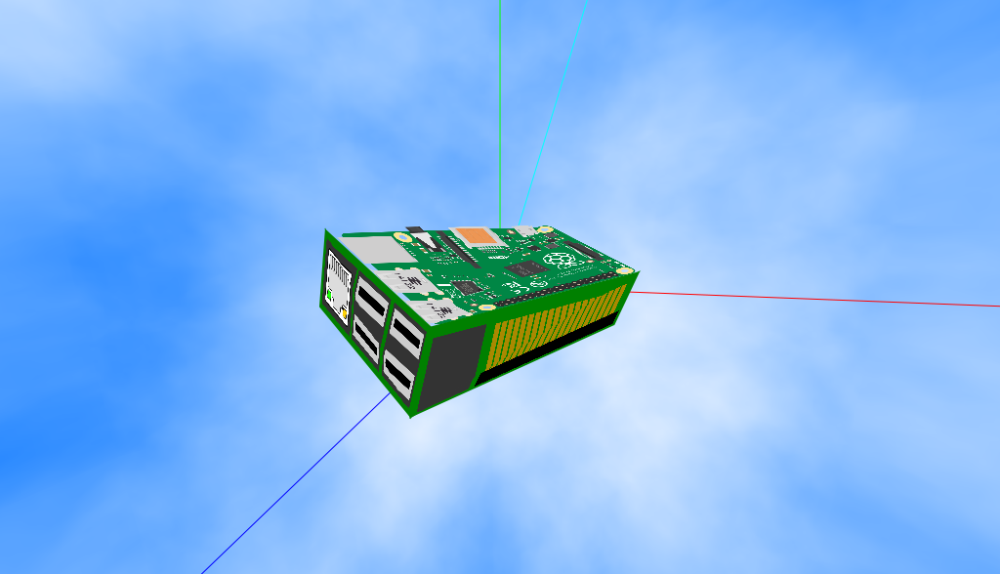

# sensorian-threejs-demo
Feeds data from Sensorian's magnetometer over websocket to a browser which rotates a Raspberry Pi model rendered with Three.js

Setup
-----

1. Tornado is required for running this demo. It can be installed by
running `sudo pip install tornado`.

2. `libsensorian.so` is required to placed in the same directory as
`SensorsInterface.py`. Copy it from `~/Sensorian/Handler_Scratch` or
from `~/Sensorian/Handler_NodeRED`. Alternatively you can build it from
the source code at [https://github.com/sensorian/sensorian-firmware/tree/master/Handler_Scratch/utilities/i2c-devices-interface](https://github.com/sensorian/sensorian-firmware/tree/master/Handler_Scratch/utilities/i2c-devices-interface).

Running
-------

To run the program run `sudo python magnetometer_server.py` then point
your browser to `<IP-ADDRESS-OF-RPI>:1982/web/index.html`.

Screenshot
----------

